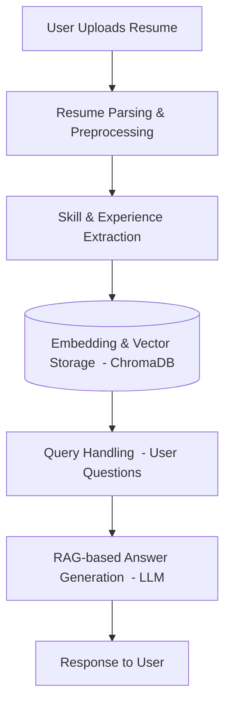

#  AI Career Assistant

AI-powered intelligent career assistant that uses Retrieval-Augmented Generation (RAG) to evaluate resumes, extract skills , suggest improvements ... , and respond to inquiries about your career profile. developed using LangChain and FastAPI.

##  Feature
-  Upload resumes in PDF, DOCX, or HTML formats
-  Ask questions about your resume (e.g., "What are my top skills?" , .... )
-  RAG-based answers using Chroma vector database
-  JWT authentication and secure user sessions
-  Modular backend with FastAPI

##  Tech Stack
- **Backend:** FastAPI, LangChain, ChromaDB
- **AI Model:** Gemini 1.5 Flash and local LLM like ollama (or configured LLM)
- **Authentication:** OAuth2 / JWT , PostgreSQL
- **Storage:** Local vector store using Chroma
- **Dev Tools:** Docker , Git, GitHub

###  Coming Soon

- **Frontend:** Flutter , Next.js + Tailwind CSS (planned)

#  Architecture – Pipeline

This is the pipeline used in the AI Career Assistant app:

##  Getting Started

Roadmap
 Upload and process resume files

 Extract key information using AI

 Implement question-answering with RAG

 Frontend dashboard with resume visualization (Coming Soon)

 Job recommendation system based on skills

 Resume rating against job descriptions

 Multi-language support